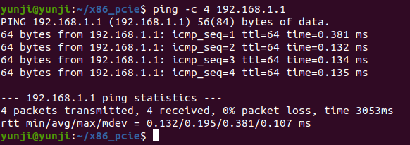
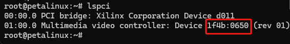
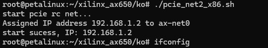
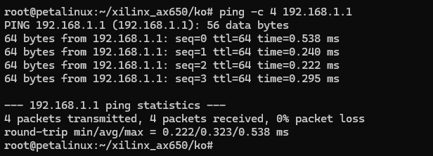
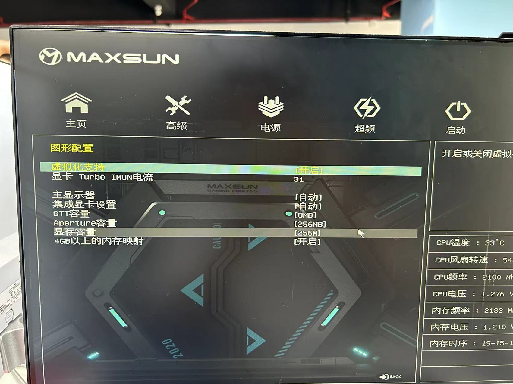

# AI 算力卡启动流程

## 已验证平台
| 平台     | arch   |    OS       | 内核       | AX650N         | DeepX|
|-------  | -------|--------      |---------- | ------------   |-----|
| intel   |x86_64  | Ubuntu20.04  |5.4.0      |   | |
| intel   |x86_64  | Ubuntu24.04  |6.8.0      |   | |
| intel   |x86_64  | CentOS 9     |5.14.0     |   | |
| AX650   |arm64   | Linux        | 5.15.73   |   |                                                 |
| rk3588  |arm64   | Ubuntu 20.04 | 5.10.110  |   | |
| Xilinx  |arm64   | petalinux    |5.4.0      |   | |
| nxp     |arm64   | ubuntu       |6.6        |                                                   | |
| rk3568  |arm64   | ubuntu 20.4  |5.10.160   |   | |

### intel(ubuntu/centos)
 
1.通过 `lspci` 检测算力卡是否存在  
确认算力卡已经插在主板上,出现厂商id：1f4b，设备id：0650，说明检测到了。  
```
zhenjie@yunji:~$ lspci | grep 650
b3:00.0 Multimedia video controller: Device 1f4b:0650 (rev 01)
```


2.获取驱动代码,在pc中进行编译驱动并加载。

``` shell
#进入对应操作系统的目录，如当前为ubuntu20.04
zhenjie@ubuntu:~/$ git clone git@github.com:Wzj910997331/yunji_driver.git
zhenjie@ubuntu:~/$ cd yunji_driver/ubuntu_20.04/ax650N_x86_64_pcie_driver/
zhenjie@ubuntu:~/$ tree -L 1
.
├── axdl
├── boot
├── common
├── host_dev
├── include
├── Makefile
├── mmb
├── msg
├── net
├── sample
└── tools
zhenjie@ubuntu:~/$ make clean all install
```

编译得到的驱动在out/ko目录下：  

``` shell
zhenjie@ubuntu:~$ tree out/ko/
out/ko/
├── ax_pcie_boot.ko
├── ax_pcie_host_dev.ko
├── ax_pcie_mmb.ko
├── ax_pcie_msg.ko
└── ax_pcie_net2.ko
```

3.加载驱动  

``` shell
#要严格按照顺序insmod相应的ko
zhenjie@yunji:~/$ sudo insmod out/ko/ax_pcie_host_dev.ko 
zhenjie@yunji:~/$ sudo insmod out/ko/ax_pcie_boot.ko 
zhenjie@yunji:~/$ sudo insmod out/ko/ax_pcie_msg.ko 
zhenjie@yunji:~/$ sudo insmod out/ko/ax_pcie_mmb.ko 
# 检查驱动是否被正确加载,如下显示说明加载成功
zhenjie@yunji:~/$ lsmod | grep ax
ax_pcie_mmb       16384 0
ax_pcie_boot      16384 0
ax_pcie_msg       16384 0
ax_pcie_host_dev  90112 2 ax_pcie_boot ax_pcie_msg
```

4.将压缩包`slave.tar.gz` 解压，  解压之后，`slave`包含算力卡的启动镜像。\
解压之后如图所示.

``` shell
#slave.tar.gz压缩包可以从百度网盘下载
通过百度网盘分享的文件：slave.tar.gz
链接：https://pan.baidu.com/s/1msJtbJ4ihsmtIJmXwzizOA?pwd=yunj 
提取码：yunj


zhenjie@ubuntu:/opt/slave$ tree -L 1
.
├── atf_bl31.img
├── AX650_slave.dtb
├── Image
├── rootfs.ext4
├── spl_AX650_slave_signed.bin
└── u-boot.bin
```


5.将编译生成out/sample目录下`sample_pcie_boot`拷贝到系统的/usr/bin目录. \
并且修改axdl脚本文件，将`SLAVE_IMAGE_PATH=/opt/slave`修改为压缩包`slave.tar.gz` 解压之后的路径slave。
``` shell
#使能环境变量
zhenjie@ubuntu:~/$ cp out/sample/sample_pcie_boot /usr/bin/
zhenjie@ubuntu:~/$ cat axdl
#!/bin/sh
#SLAVE_IMAGE_PATH=/opt/slave
```

6.执行`sudo ./axdl` 启动算力卡  
 

7.为主板创建虚拟网卡，方便与算力卡通信，进入到`x86_pcie`目录下，执行以下脚本命令:  
  
该脚本会加载一个网卡驱动`ax_pcie_net2.ko`, 并在主板创建一个虚拟网卡`ax-net0`，IP为`192.168.1.2`  
  

8.尝试与算力卡进行通信：  
  
通信成功。通过`ssh`进入算力卡  
  
默认密码是`123456`。

### AX650 linux
若主板是AX650的主板，已经预先加载好，无需先加载驱动，可直接启动算力卡。
1. 通过 `lspci` 检测算力卡是否存在  
  
如图所示，出现厂商id：1f4b，设备id：0650，说明检测到了。  

2. 在主板执行 `axdl`，会通过PCIE推送小卡的启动镜像文件到算力卡中。执行`axdl`之后，算力卡会启动进入文件系统，并且执行默认的脚本，创建一个虚拟网卡，名字默认为ax-net0，并且配置网络，默认IP是`192.168.1.1`。
  

3. 在主板先执行`sleep 30`，静待30秒，然后再执行 `pcie_net2.sh master`。脚本会在主板会加载驱动以及配置IP地址，这将会在主板创建一个虚拟网卡，名字为`ax-net0`，IP为 `192.168.1.2`
  

4. 接下来可通过`ping` 检测是否可以和算力卡通信  


5. 通过 `ssh` 可进入算力卡，密码默认`123456`  


### Centos 9 内核 5.14.0-446.el9.x86_64
centos的算力卡启动流程和ubuntu20.04基本一致，`x86_pcie.tgz` 替换成 `x86_64_pcie_centos9_kernel_5.14.0-446.el9.x86_64.tar.gz`即可

### Ubuntu 24.04 内核 6.8
启动流程与Ubuntu20.4一致，`x86_pcie.tgz` 替换成 `x86_64_pcie_ubuntu24.04_kernel_6.8.tar.gz`即可


### 赛灵思
#### petalinux 内核 5.4
1. 检测算力卡是否被检测到了  
  
出现```1f4b:0650```的标志，说明检测到了。  

2. 将我们提供的驱动和启动文件解压。    
  

3. 进入ko文件中，执行脚本文件启动算力卡
    
等待一分钟让算力卡正常启动，算力卡会自动创建虚拟网卡IP为192.168.1.1。  

4. 执行本地虚拟网卡创建脚本
  
本地会创建虚拟网卡，IP为192.168.1.2  

5. 测试与算力卡的通信  
  
通信正常

### NXP

#### rk3568 内核 4.19.232

启动流程和上述Ubuntu一致。  
注：编译需要的linux-headers 包含各种头文件，可以让设备具有本地编译驱动的能力。需要去[下载](https://www.t-firefly.com/doc/download/107.html).

下载后得到文件：```linux-headers-4.19.232_4.19.232-438_arm64.deb```

安装
```
sudo dpkg -i linux-headers-4.19.232_4.19.232-438_arm64.deb
```
确认内核头文件路径是否存在
```
ls -l /lib/modules/$(uname -r)/build
```

Troubleshooting:  
```
root@firefly:~/x86_pcie# make
make -C /lib/modules/4.19.232/build M=/root/x86_pcie KCFLAGS=-DIS_THIRD_PARTY_PLATFORM modules
make[1]: Entering directory '/usr/src/linux-headers-4.19.232'
  CC [M]  /root/x86_pcie/host_dev/ax_pcie_dev_host.o
/bin/sh: 1: scripts/basic/fixdep: Exec format error
make[2]: *** [scripts/Makefile.build:334: /root/x86_pcie/host_dev/ax_pcie_dev_host.o] Error 2
make[2]: *** Deleting file '/root/x86_pcie/host_dev/ax_pcie_dev_host.o'
make[1]: *** [Makefile:1676: _module_/root/x86_pcie] Error 2
make[1]: Leaving directory '/usr/src/linux-headers-4.19.232'
make: *** [Makefile:30: all] Error 2
```
出现 `scripts/basic/fixdep: Exec format error` 错误通常是因为内核构建系统中的工具 `fixdep` 是为不同的架构编译的，而不是当前系统架构（arm64）。为了解决这个问题，需要重新编译这些工具。

以下是解决这个问题的步骤：

#### 步骤 1：安装所需工具

确保你有必要的工具安装来编译内核源代码。你需要 `make`、`gcc` 等编译工具。

```bash
sudo apt-get update
sudo apt-get install build-essential
```

#### 步骤 2：重新编译内核构建工具

进入内核头文件目录并重新编译构建工具：

```bash
cd /usr/src/linux-headers-4.19.232
make scripts
```

这会重新编译所有用于构建内核模块的脚本和工具，以确保它们与当前系统架构匹配。

#### 步骤 3：再次尝试编译模块

返回到模块源码目录并再次尝试编译模块：

```bash
cd /root/x86_pcie
make
```

#### 示例：

以下是完整的示例步骤：

```bash
# 安装所需的编译工具
sudo apt-get update
sudo apt-get install build-essential

# 进入内核头文件目录
cd /usr/src/linux-headers-4.19.232

# 重新编译内核构建工具
make scripts

# 返回到模块源码目录
cd /root/x86_pcie

# 编译模块
make
```

通过重新编译内核构建工具，这些工具将与当前系统架构匹配，从而避免 `Exec format error` 错误。然后再次尝试编译模块应该能够成功。


## 常见问题
1.执行`axdl`之后，再执行`dmesg`发现报错：Failed to get Msl interrupts。  \
首先排除是不是系统的影响，要开内核是否开启CONFIG_PCI_MSI的宏，然后要看电脑的主板BIOS是否限制中断。 \
如果是华硕主板配置为开启`虚拟化支持`选项。 
  

如果是技嘉主板配置为开启`VT-d`选项。 
  

2.执行 `insmod ax_pcie_host_dev.ko`,再执行`dmesg`发现报错：failed to allocate mem space.  \
可以修改内存分配这部分代码为 `dma_alloc_coherent(&pdev->dev, size + alignment, &org_phys_addr, GFP_KERNEL | __GFP_ZERO);`的size为 1024*1024，即可解决问题。

3.没有ubuntu22.04和18.04的对应怎么办？ \
20.04可以直接兼容18.04，24.04可以兼容22.04.