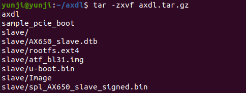
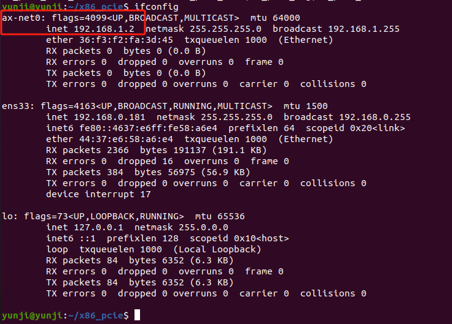

# AI 算力卡启动流程

### 已验证平台
| 平台 |arch | OS  |内核      | AX650N         | DeepX|
|-----| --|--------|--- | ------------ |-----|
| AX650|aarch64|Linux | 5.15.73     |   |
| intel| x86_64 | Ubuntu 20.04|5.4.0-182-generic|    ||
| rk3588 | aarch64|Ubuntu 20.04| 5.10.110-rockchip-rk3588| ||
| intel|x86_64 | CentOS 9      |5.14.0-446.el9.x86_64 |      | 
| intel|x86_64 | Ubuntu 24.04     |6.8.0-31-generic |      | |
| Xilinx|aarch64 | petalinux    |5.4.0 |      |   |
| nxp|aarch64 | ubuntu    |6.6|      | 
| rk3568|aarch64 | ubuntu 20.4    |5.10.160|      | |

## AX650 linux
若主板是AX650的主板，那么无需先加载驱动，可直接启动算力卡。  
1. 通过 `lspci` 检测算力卡是否存在  
  
如图所示，出现厂商id：1f4b，设备id：0650，说明检测到了。  

2. 在主板执行 `axdl`，启动算力卡  
  
`axdl`将会与算力卡通信，并启动算力卡。  

3. 算力卡通过`axdl`启动之后，将会自动为算力卡创建一个虚拟网卡，IP是`192.168.1.1`。 在执行`axdl`之后，静待30秒，等待算力卡启动以及创建虚拟网卡，然后，在主板创建虚拟网卡，方便与算力卡通信。在主板执行 `pcie_net2.sh master`    
  
这将会在主板创建一个虚拟网卡，IP为 `192.168.1.2`
  
4. 接下来可通过`ping` 检测是否可以和算力卡通信  


5. 通过 `ssh` 可进入算力卡，密码默认`123456`  


## intel / rk3588 x86_64
### ubuntu20.04
确认算力卡已经插在主板上了。  
1. 通过 `lspci` 检测算力卡是否存在  
  
检测到该设备，出现厂商id：1f4b，设备id：0650，说明检测到了。  

2. 要启动算力卡，首先加载驱动，将我们提供的压缩包`x86_pcie.tgz`解压。再执行编译，将会得到编译后的驱动。
    ```
    tar -zxvf x86_pcie.tgz
    cd x86_pcie
    make
    make install
    ```
    编译得到的驱动在该目录：  
      

3. 加载驱动  
   
执行`lsmod`, 检查驱动是否被正确加载  
  
显示加载成功  

4. 驱动加载成功后，就可以启动算力卡了，先将我们提供的压缩包`axdl.tar.gz` 解压，  
  
解压之后，得到`axdl`执行文件，`sample_pcie_boot`可执行程序，`slave`包含算力卡的文件系统。  

5. 将刚在x86_pcie下编译得到的`sample_pcie_boot`替换`axdl.tar.gz`解压后得到的`sample_pcie_boot`,  
  

6. 执行`sudo ./axdl` 启动算力卡  
  
如果算力卡显示绿灯，及正常启动了算力卡。算力卡启动后，会自动创建一个虚拟网卡，IP为`192.168.1.1`  

7. 为主板创建虚拟网卡，方便与算力卡通信，进入到`x86_pcie`目录下，执行以下脚本命令:  
  
该脚本会加载一个网卡驱动`ax_pcie_net2`, 并在主板创建一个虚拟网卡，IP为`192.168.1.2`  
  

8. 尝试与算力卡进行通信：  
  
通信成功。通过`ssh`进入算力卡  
  
默认密码是`123456`。

### Centos 9 内核 5.14.0-446.el9.x86_64
centos的算力卡启动流程和ubuntu20.04基本一致，`x86_pcie.tgz` 替换成 `x86_64_pcie_centos9_kernel_5.14.0-446.el9.x86_64.tar.gz`即可

### Ubuntu 24.04 内核 6.8
启动流程与Ubuntu20.4一致，`x86_pcie.tgz` 替换成 `x86_64_pcie_ubuntu24.04_kernel_6.8.tar.gz`即可


## 赛灵思
### petalinux 内核 5.4
1. 检测算力卡是否被检测到了  
  
出现```1f4b:0650```的标志，说明检测到了。  

2. 将我们提供的驱动和启动文件解压。    
  

3. 进入ko文件中，执行脚本文件启动算力卡
    
等待一分钟让算力卡正常启动，算力卡会自动创建虚拟网卡IP为192.168.1.1。  

4. 执行本地虚拟网卡创建脚本
  
本地会创建虚拟网卡，IP为192.168.1.2  

5. 测试与算力卡的通信  
  
通信正常

## NXP

## rk3568 内核 4.19.232

启动流程和上述Ubuntu一致。  
注：编译需要的linux-headers 包含各种头文件，可以让设备具有本地编译驱动的能力。需要去[下载](https://www.t-firefly.com/doc/download/107.html).

下载后得到文件：```linux-headers-4.19.232_4.19.232-438_arm64.deb```

安装
```
sudo dpkg -i linux-headers-4.19.232_4.19.232-438_arm64.deb
```
确认内核头文件路径是否存在
```
ls -l /lib/modules/$(uname -r)/build
```

Troubleshooting:  
```
root@firefly:~/x86_pcie# make
make -C /lib/modules/4.19.232/build M=/root/x86_pcie KCFLAGS=-DIS_THIRD_PARTY_PLATFORM modules
make[1]: Entering directory '/usr/src/linux-headers-4.19.232'
  CC [M]  /root/x86_pcie/host_dev/ax_pcie_dev_host.o
/bin/sh: 1: scripts/basic/fixdep: Exec format error
make[2]: *** [scripts/Makefile.build:334: /root/x86_pcie/host_dev/ax_pcie_dev_host.o] Error 2
make[2]: *** Deleting file '/root/x86_pcie/host_dev/ax_pcie_dev_host.o'
make[1]: *** [Makefile:1676: _module_/root/x86_pcie] Error 2
make[1]: Leaving directory '/usr/src/linux-headers-4.19.232'
make: *** [Makefile:30: all] Error 2
```
出现 `scripts/basic/fixdep: Exec format error` 错误通常是因为内核构建系统中的工具 `fixdep` 是为不同的架构编译的，而不是当前系统架构（arm64）。为了解决这个问题，需要重新编译这些工具。

以下是解决这个问题的步骤：

### 步骤 1：安装所需工具

确保你有必要的工具安装来编译内核源代码。你需要 `make`、`gcc` 等编译工具。

```bash
sudo apt-get update
sudo apt-get install build-essential
```

### 步骤 2：重新编译内核构建工具

进入内核头文件目录并重新编译构建工具：

```bash
cd /usr/src/linux-headers-4.19.232
make scripts
```

这会重新编译所有用于构建内核模块的脚本和工具，以确保它们与当前系统架构匹配。

### 步骤 3：再次尝试编译模块

返回到模块源码目录并再次尝试编译模块：

```bash
cd /root/x86_pcie
make
```

### 示例：

以下是完整的示例步骤：

```bash
# 安装所需的编译工具
sudo apt-get update
sudo apt-get install build-essential

# 进入内核头文件目录
cd /usr/src/linux-headers-4.19.232

# 重新编译内核构建工具
make scripts

# 返回到模块源码目录
cd /root/x86_pcie

# 编译模块
make
```

通过重新编译内核构建工具，这些工具将与当前系统架构匹配，从而避免 `Exec format error` 错误。然后再次尝试编译模块应该能够成功。
