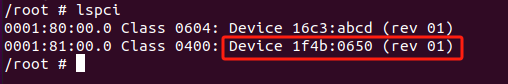
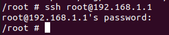
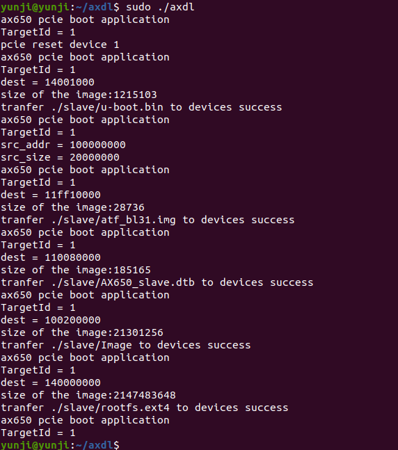

# AI 算力卡启动流程

### 已验证平台
| 平台 |arch | OS  |内核      | AX650N         | DeepX|
|-----| --|--------|--- | ------------ |-----|
| AX650|aarch64|Linux | 5.15.73     |   |
| intel| x86_64 | Ubuntu 20.04|5.4.0-182-generic|    ||
| rk3588 | aarch64|Ubuntu 20.04| 5.10.110-rockchip-rk3588| ||
| intel|x86_64 | CentOS 9      |5.14.0-446.el9.x86_64 |      | 
|

## AX650 linux
若主板是AX650的主板，那么无需先加载驱动，可直接启动算力卡。  
1. 通过 `lspci` 检测算力卡是否存在  
  
如图所示，出现厂商id：1f4b，设备id：0650，说明检测到了。  

2. 在主板执行 `axdl`，启动算力卡  
  
`axdl`将会与算力卡通信，并启动算力卡。  

3. 算力卡通过`axdl`启动之后，将会自动为算力卡创建一个虚拟网卡，IP是`192.168.1.1`。 在执行`axdl`之后，静待30秒，等待算力卡启动以及创建虚拟网卡，然后，在主板创建虚拟网卡，方便与算力卡通信。在主板执行 `pcie_net2.sh master`    
  
这将会在主板创建一个虚拟网卡，IP为 `192.168.1.2`
  
4. 接下来可通过`ping` 检测是否可以和算力卡通信  


5. 通过 `ssh` 可进入算力卡，密码默认`123456`  



## intel / rk3588 x86_64
### ubuntu20.04
确认算力卡已经插在主板上了。  
1. 通过 `lspci` 检测算力卡是否存在  
  
检测到该设备，出现厂商id：1f4b，设备id：0650，说明检测到了。  

2. 要启动算力卡，首先加载驱动，将我们提供的压缩包`x86_pcie.tgz`解压。再执行编译，将会得到编译后的驱动。
    ```
    tar -zxvf x86_pcie.tgz
    cd x86_pcie
    make
    make install
    ```
    编译得到的驱动在该目录：  
      

3. 加载驱动  
   
执行`lsmod`, 检查驱动是否被正确加载  
  
显示加载成功  

4. 驱动加载成功后，就可以启动算力卡了，先将我们提供的压缩包`axdl.tar.gz` 解压，  
  
解压之后，得到`axdl`执行文件，`sample_pcie_boot`可执行程序，`slave`包含算力卡的文件系统。  

5. 将刚在x86_pcie下编译得到的`sample_pcie_boot`替换`axdl.tar.gz`解压后得到的`sample_pcie_boot`,  
  

6. 执行`sudo ./axdl` 启动算力卡  
  
如果算力卡显示绿灯，及正常启动了算力卡。算力卡启动后，会自动创建一个虚拟网卡，IP为`192.168.1.1`  

7. 为主板创建虚拟网卡，方便与算力卡通信，进入到`x86_pcie`目录下，执行以下脚本命令:  
  
该脚本会加载一个网卡驱动`ax_pcie_net2`, 并在主板创建一个虚拟网卡，IP为`192.168.1.2`  
  

8. 尝试与算力卡进行通信：  
  
通信成功。通过`ssh`进入算力卡  
  
默认密码是`123456`。

### Centos 9 内核版本 5.14.0-446.el9.x86_64
centos的算力卡启动流程和ubuntu基本一致，`x86_pcie.tgz` 替换成 `x86_64_pcie_centos9_kernel_5.14.0-446.el9.x86_64.tar.gz`即可，